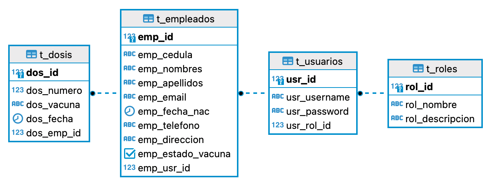

# Reto Kruger

## Condiciones del desarrollo
* Tecnologías a utilizar son:
    * Lenguaje: JAVA
    * Framework: Spring boot.
    * Persistencia de datos: Base de datos Postgresql.
* Se debe exponer el API Rest necesaria, para poder consumir los
servicios de la aplicación.
* Se debe implementar la documentación de la API (Swagger-OpenAPI)
* Puede implementar autenticación OAuth 2.0, seguridades de los
endpoints basado en roles de usuarios
* Incluir el modelo de datos.
* Incluir todos los archivos necesarios para poder montar la aplicación en
un ambiente nuevo.
* Incluir un README detallando el proceso de construcción y
ejecución de la aplicación.

## Proceso de construcción
Para la construcción de esta aplicación se creó un proyecto usando el framework Spring Boot, la gestión del proyecto está basada en Maven.

Primero se procedió a diseñar el modelo de datos para poder tener una visión clara de la aplicación que se va a construir, posteriormente se realizó un script para crear el esquema de la BD.

Con el esquema de la BD se procedió a mapear las entidades dentro del proyecto de Spring Boot, y se empezó a construir los diferentes endpoints solicitados.

Una vez creados los endpoints, con la ayuda de Spring Security se agregó autorización basada en roles, en donde el ADMIN tiene acceso a todos los endpoints, y el rol USER únicamente a los endpoints para ver y actualizar su información.

Posteriormente se procedió a documentar los endpoints con la ayuda de Swagger.

Finalmente, con docker-compose se crearon contenedores para montar la aplicación y BD en cualquier ambiente.


## Despliege de la aplicación

Es necesario tener instalado Docker para proceder a desplegar la app.

Primero se debe clonar el repositorio:
```git
git clone https://github.com/damoralesr97/reto_kruger_backend.git
```

Entrar al direcctorio del repositorio que acabamos de clonar y ejecturar los siguientes comandos.
```docker
docker-compose -f docker-compose.yml up --no-start
docker-compose -f docker-compose.yml start
```
Con esto se levantara la app de Spring Boot en el puerto 8080, y la BD PostreSql en el puerto 5432 con la siguiente estructura:


Diagrama ER de la BD.

Cuando se levanta la app de Spring Boot se crea el usuario Administrador, con las siguientes credenciales: 
* **usuario:** admin
* **contraseña:** admin

Para consumir los endpoints se lo realizá a través del context-path `api/v1` seguido del endpoint.

Para conocer mas información acerca de los endpoints se lo puede hacer desde el siguiente enlace http://localhost:8080/api/v1/swagger-ui.html#/


Cuando el administrador crea un empleado unicamente debe especificar la informacion basica (C.I, Nombres, Apellidos e email) y automaticamente se generara un usuario y contraseña para el empleado. El usuario consta de la primera letra del nombre + apellido y la contraseña es el número de cédula.

#### Ejemplo de usuario y contraseña para el empleado
**C.I:** 0107656765
**Nombres:** Juan
**Apellidos:** Flores
**Email:** jflores@gmail.com

El sistema creará el siguiente usuario y contraseña para el empleado:
**usuario:** jflores
**contraseña:** 0107656765
